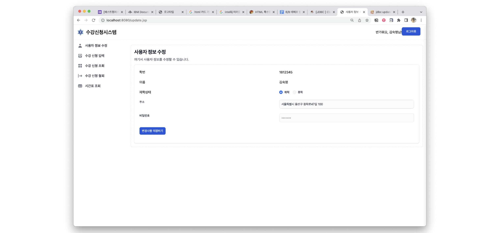

# 수강신청 시스템 : 2023 데이터베이스프로그래밍 과제
##### 2023-1 데이터베이스프로그래밍 기말 팀 프로젝트

### 팀원

| 이름  | 역할                           |
|-----|------------------------------|
| 강보경 | 수강 조회, 시간표, 더미 데이터           |
| 임예지 | 로그인&아웃, 사용자 정보수정, 발표자료       |
| 최예빈 | 수강 신청, 삭제, 교수 수업 조회, 삭제, CSS |

### 개발 환경

```shell
oracle 21c-xe
Java 8
Tomcat 9
ojdbc8.jar
```

### 기능 
**필수 기능**
- 로그인/로그아웃
- 사용자 정보 수정
- 수강 신청 입력

**추가 기능**
- 수강 신청 삭제
- 수강 신청 조회
  - 연도, 학기 별 수강 내역 조회
  - 시간표 생성
- 교수 전용 페이지
  - 강의 생성
  - 개설 강의 조회/삭제

### ERD


### 화면

1. 로그인


2. 사용자 정보 수정



3. 수강 신청 입력

- 검색


- 신청 시 예외 처리


4. 수강 신청 삭제


5. 수강 신청 조회

- 연도와 학기로 조회


- 시간표 조회


7. 교수 강의 생성


8. 교수 개설 강의 조회/삭제
